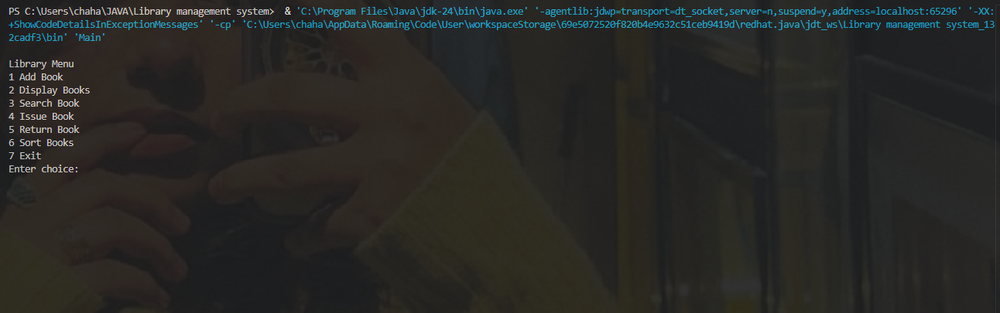
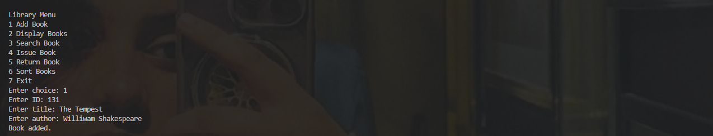
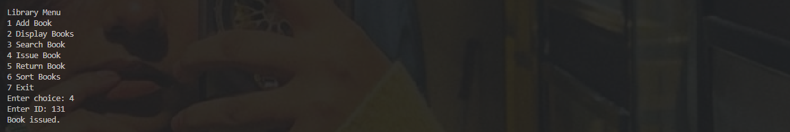

# Library Management System (Java + DSA)

A simple console-based Library Management System built using Java.

## Features

- Add books
- Display books
- Search books
- Issue books
- Return books
- Sort books
- File storage using books.txt

## Technologies Used

- Java
- ArrayList
- File Handling
- Sorting algorithms

## How to Run

Compile the program:

```
javac *.java
```

Run the program:

```
java Main
```

## Screenshots

### Program Running



### Adding Book



### Issue Book


